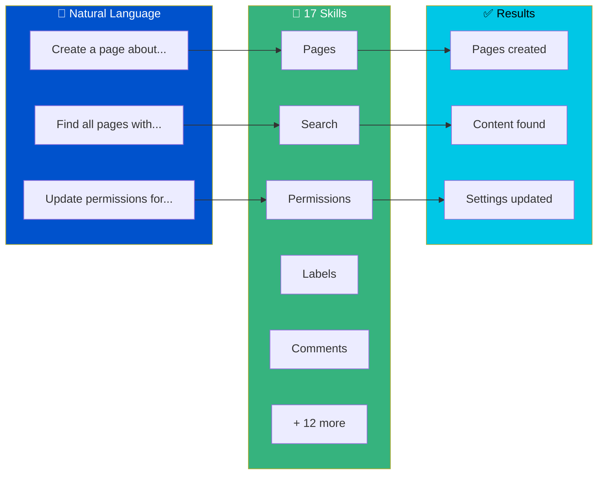

<div align="center">

<!-- HERO SECTION -->


<br><br>

<!-- STATS BAR -->
<table>
<tr>
<td align="center"><strong>17</strong><br><sub>Skills</sub></td>
<td align="center"><strong>108</strong><br><sub>CLI Commands</sub></td>
<td align="center"><strong>10</strong><br><sub>E2E Tests</sub></td>
<td align="center"><strong>CQL</strong><br><sub>Query Support</sub></td>
</tr>
</table>

<br>

<!-- BADGES -->
[](https://github.com/grandcamel/Confluence-Assistant-Skills/releases)
[](https://pypi.org/project/confluence-as/)
[](LICENSE)
[](https://www.python.org/downloads/)
[](https://www.atlassian.com/software/confluence)

<br>

### 🚀 Stop clicking through Confluence. Start talking to it.

**Confluence Assistant Skills** brings the power of natural language automation to Confluence Cloud.<br>
Ask Claude to create pages, search content, manage permissions, and more — all without leaving your terminal.

<br>

<!-- QUICK DEMO -->
```
You: "Find all pages labeled 'api-docs' modified this week and export to CSV"

Claude: Found 23 pages matching your criteria.
        ✓ Exported to api-docs-report.csv
```

<br>

[Get Started](#-quick-start) · [View Skills](#-available-skills) · [Documentation](CLAUDE.md) · [Contributing](#-contributing)

</div>

<br>

---

<br>

<!-- PROBLEM / SOLUTION -->
<table>
<tr>
<td width="50%" valign="top">

### 😤 Without Assistant Skills

```
1. Open browser
2. Navigate to Confluence
3. Click through menus
4. Find the right space
5. Create page manually
6. Copy-paste content
7. Format everything
8. Add labels one by one
9. Set permissions
10. Repeat for next page...
```

**Time: 15+ minutes per page**

</td>
<td width="50%" valign="top">

### 🎯 With Assistant Skills

```
You: "Create a page called 'Q4 Planning'
      in the DOCS space with the content
      from my notes.md file, label it
      'planning' and 'q4-2024'"

Claude: ✓ Created page "Q4 Planning"
        ✓ Added 2 labels
        ✓ Page ID: 12345
```

**Time: 10 seconds**

</td>
</tr>
</table>

<br>

---

<br>

## ⚡ Quick Start

<table>
<tr>
<td>

### 1️⃣ Install

**Option A: Claude Code Plugin** (recommended)
```
/plugin grandcamel/Confluence-Assistant-Skills
```

**Option B: Marketplace**
```bash
claude plugin marketplace add https://github.com/grandcamel/confluence-assistant-skills.git#main
claude plugin install confluence-assistant-skills@confluence-assistant-skills-marketplace --scope user
```

**Option C: Manual**
```bash
git clone https://github.com/grandcamel/Confluence-Assistant-Skills.git
pip install "confluence-as>=1.1.1"
```

</td>
</tr>
<tr>
<td>

### 2️⃣ Configure

```bash
export CONFLUENCE_SITE_URL="https://your-site.atlassian.net"
export CONFLUENCE_EMAIL="you@company.com"
export CONFLUENCE_API_TOKEN="your-api-token"
```

<sub>Get your API token from [Atlassian Account Settings](https://id.atlassian.com/manage-profile/security/api-tokens)</sub>

</td>
</tr>
<tr>
<td>

### 3️⃣ Install CLI

```bash
pip install "confluence-as>=1.1.1"

# Verify installation
confluence-as --version
confluence-as space list --limit 1
```

</td>
</tr>
<tr>
<td>

### 4️⃣ Use

```bash
# CLI commands
confluence-as page get 12345
confluence-as search cql "space = DOCS"
confluence-as label add 12345 approved

# Or ask Claude naturally:
"Create a page titled 'Meeting Notes' in the DOCS space"
"Search for pages about API documentation"
"Add label 'approved' to page 12345"
```

</td>
</tr>
</table>

<br>

---

<br>

## 🔧 Setup (Assistant Skills)

If you're using this as part of the **Assistant Skills** ecosystem, run the setup wizard after installing:

```bash
/confluence-assistant-setup
```

This configures:
- The `confluence-as` CLI from PyPI (`pip install "confluence-as>=1.1.1"`)
- Environment variables (prompts you to set: `CONFLUENCE_SITE_URL`, `CONFLUENCE_EMAIL`, `CONFLUENCE_API_TOKEN`)
- Connection validation against your Confluence site

### Environment Variables

| Variable | Required | Description |
|----------|----------|-------------|
| `CONFLUENCE_SITE_URL` | Yes | Confluence Cloud site URL (e.g., `https://your-site.atlassian.net`) |
| `CONFLUENCE_EMAIL` | Yes | Atlassian account email for API authentication |
| `CONFLUENCE_API_TOKEN` | Yes | API token from [Atlassian Account Settings](https://id.atlassian.com/manage-profile/security/api-tokens) |

<br>

---

<br>

## 🎯 What You Can Do



<br>

---

<br>

## 📦 Available Skills

| Skill | Purpose | Example Commands |
|-------|---------|------------------|
| **confluence-page** | Create, read, update, delete pages | `page create`, `page get`, `page update`, `page copy`, `page move` |
| **confluence-space** | Manage spaces | `space list`, `space create`, `space get`, `space delete` |
| **confluence-search** | CQL queries & export | `search cql`, `search content`, `search export`, `search validate` |
| **confluence-comment** | Page comments | `comment add`, `comment list`, `comment update`, `comment delete` |
| **confluence-attachment** | File attachments | `attachment upload`, `attachment download`, `attachment list` |
| **confluence-label** | Content labeling | `label add`, `label remove`, `label list` |
| **confluence-template** | Page templates | `template list`, `template get`, `template create-from` |
| **confluence-property** | Content properties | `property get`, `property set`, `property delete` |
| **confluence-permission** | Access control | `permission space get`, `permission space add` |
| **confluence-analytics** | View statistics | `analytics views` |
| **confluence-watch** | Content watching | `watch page`, `watch unwatch-page` |
| **confluence-hierarchy** | Page tree navigation | `hierarchy ancestors`, `hierarchy children`, `hierarchy descendants` |
| **confluence-jira** | JIRA integration | `jira embed`, `jira linked` |
| **confluence-admin** | Users, groups, space administration | `admin user search`, `admin group list`, `admin space permissions` |
| **confluence-bulk** | Bulk operations on multiple pages | `bulk update`, `bulk move`, `bulk delete`, `bulk label add` |
| **confluence-ops** | Diagnostics & cache management | `ops health-check`, `ops cache-status`, `ops cache-clear` |
| **confluence-assistant** | Central hub | Routes to specialized skills |

<br>

---

<br>

## 🔍 CQL Query Power

Full Confluence Query Language support with validation, suggestions, and export.

<table>
<tr>
<td width="50%">

### Find Content

```sql
-- Pages in a space
space = "DOCS" AND type = page

-- By label
label = "approved" AND label = "api"

-- Text search
text ~ "API documentation"

-- Recent changes
lastModified >= startOfWeek()
```

</td>
<td width="50%">

### Export Results

```bash
# Export to CSV
confluence-as search export "label = 'release-notes'" \
  --format csv \
  --output releases.csv

# Export to JSON
confluence-as search export "space = 'DOCS'" \
  --format json \
  --output docs.json
```

</td>
</tr>
</table>

<br>

---

<br>

## 👥 Who Is This For?

<details>
<summary><strong>📝 Technical Writers</strong> — Automate documentation workflows</summary>

<br>

- Bulk create pages from templates
- Search and update outdated content
- Export content for review
- Manage labels across hundreds of pages

```bash
# Find all pages needing review
confluence-as search cql "label = 'needs-review' AND lastModified < startOfMonth(-3)"
```

</details>

<details>
<summary><strong>🛠️ DevOps Engineers</strong> — Integrate Confluence into CI/CD</summary>

<br>

- Auto-generate release notes
- Update runbooks from code
- Sync documentation with deployments
- Create incident pages automatically

```bash
# Create release notes page
confluence-as page create --space RELEASES --title "v2.5.0" --file CHANGELOG.md
```

</details>

<details>
<summary><strong>👔 Project Managers</strong> — Streamline project documentation</summary>

<br>

- Create project spaces from templates
- Generate status reports
- Track page analytics
- Manage team permissions

```bash
# Get page view statistics
confluence-as analytics views 12345 --output json
```

</details>

<details>
<summary><strong>🔒 IT Administrators</strong> — Manage Confluence at scale</summary>

<br>

- Audit space permissions
- Bulk update settings
- Export content for compliance
- Automate user provisioning

```bash
# List all space permissions
confluence-as permission space get DOCS --output json
```

</details>

<br>

---

<br>

## 🏗️ Architecture

```
# Root configuration
pytest.ini                    # Test paths, markers, import mode
conftest.py                   # Shared fixtures and pytest hooks

skills/
├── confluence-assistant/     # Hub skill - routes requests
├── confluence-page/          # Page CRUD operations
├── confluence-space/         # Space management
├── confluence-search/        # CQL queries & export
├── confluence-comment/       # Comments
├── confluence-attachment/    # File attachments
├── confluence-label/         # Labels
├── confluence-template/      # Templates
├── confluence-property/      # Content properties
├── confluence-permission/    # Permissions
├── confluence-analytics/     # Analytics
├── confluence-watch/         # Watching
├── confluence-hierarchy/     # Page tree
├── confluence-jira/          # JIRA integration
├── confluence-admin/         # Administration
├── confluence-bulk/          # Bulk operations
├── confluence-ops/           # Diagnostics & cache
└── shared/
    ├── config/               # Configuration schema
    └── docs/                 # Shared reference docs

# Shared library (PyPI package)
confluence-as
├── confluence_client.py      # HTTP client with retry
├── config_manager.py         # Configuration management
├── error_handler.py          # Exception handling
├── validators.py             # Input validation
└── formatters.py             # Output formatting
```

<br>

---

<br>

## 🔐 Configuration

### Environment Variables

All configuration is done through environment variables:

```bash
export CONFLUENCE_SITE_URL="https://your-site.atlassian.net"
export CONFLUENCE_EMAIL="you@company.com"
export CONFLUENCE_API_TOKEN="your-api-token"
```

| Variable | Required | Description |
|----------|----------|-------------|
| `CONFLUENCE_SITE_URL` | Yes | Confluence Cloud site URL |
| `CONFLUENCE_EMAIL` | Yes | Atlassian account email |
| `CONFLUENCE_API_TOKEN` | Yes | API token from [Atlassian Account Settings](https://id.atlassian.com/manage-profile/security/api-tokens) |

<br>

---

<br>

## ✅ Quality & Testing

| Metric | Value |
|--------|-------|
| E2E Tests | Claude Code plugin integration (`tests/e2e/`) |
| Unit & Live Tests | Maintained in the [confluence-as](https://github.com/grandcamel/confluence-as) library |
| Code Style | PEP 8 compliant |

*This repo ships skills (documentation) — the CLI code and its unit/live integration tests live in the [confluence-as](https://github.com/grandcamel/confluence-as) library.*

```bash
# Run E2E tests (requires the Claude Code CLI plus
# ANTHROPIC_API_KEY or an existing ~/.claude login)
./scripts/run-e2e-tests.sh           # Docker
./scripts/run-e2e-tests.sh --local   # Local

# Or invoke pytest directly
pytest tests/e2e/ -v

# Unit and live integration tests live in the confluence-as library
# See: https://github.com/grandcamel/confluence-as
```

<br>

---

<br>

## Before each plugin release

Before merging the release-please release PR, run the shared Knowledge Floor
job on a host with authenticated headless `claude` and `codex` CLIs. Also run it
when a model change in the organization's
`docs/agents/standing/fleet-posture.json` changes the floor models or judge;
update the shared job's `commands.json` and choose a fresh output directory.
The driver and full 153-fact inventory live in a sibling
`JIRA-Assistant-Skills/tests/floor_eval/` checkout:

```bash
python3 ../JIRA-Assistant-Skills/tests/floor_eval/run_eval.py \
  --output ../JIRA-Assistant-Skills/tests/floor_eval/runs/pre-release
# Focused Confluence run, after a full baseline exists:
python3 ../JIRA-Assistant-Skills/tests/floor_eval/run_eval.py \
  --repo confluence \
  --output ../JIRA-Assistant-Skills/tests/floor_eval/runs/confluence-release
```

Add `--resume` to the same command after an interruption; use separate output
directories for changed inputs or a new release. Archive `classification.json`,
`flipped-to-floor.md`, `stale-facts.md`, `run_summary.json`, manifest and raw
receipts from the output directory. Incomplete facts must finish; fake or
filtered smoke runs cannot establish the full cut list. Review model
disagreements and citation notes, and live-reverify stale-fact candidates
before applying the cut list. This is **host-run, never in GitHub Actions**:
runners do not have the required CLIs or model credentials. No Atlassian site
credentials are used by the evaluator. See [the job pointer](tests/floor_eval/README.md).

## 🛠️ Troubleshooting

<details>
<summary><strong>Authentication failed</strong></summary>

1. Verify API token at [Atlassian Account Settings](https://id.atlassian.com/manage-profile/security/api-tokens)
2. Ensure email matches the token owner
3. Check URL includes `https://` and ends with `.atlassian.net`

</details>

<details>
<summary><strong>Permission denied</strong></summary>

1. Verify access in Confluence web UI
2. Some operations require admin permissions
3. Check if content is restricted

</details>

<details>
<summary><strong>CQL syntax error</strong></summary>

```bash
# Validate your query
confluence-as search validate "your query"
```

Check quotes are balanced and field names are valid.

</details>

<details>
<summary><strong>Plugin installation fails</strong></summary>

Claude Code strictly validates `plugin.json`. Common issues:

1. **Unrecognized keys** - Remove any custom keys (only standard plugin.json fields allowed)
2. **Wrong marketplace name** - Use `plugin@marketplace-name` format
3. **Cache path** - Plugin cache includes `.claude-plugin/` directory

```bash
# Verify installation
cat ~/.claude/plugins/cache/*/confluence-assistant-skills/*/.claude-plugin/plugin.json
```

</details>

<br>

---

<br>

## 📚 Documentation

| Resource | Description |
|----------|-------------|
| [CLAUDE.md](CLAUDE.md) | Developer guide, patterns, API reference |
| [CHANGELOG.md](CHANGELOG.md) | Release history |
| [Confluence API Docs](https://developer.atlassian.com/cloud/confluence/rest/v2/intro/) | Official API reference |

<br>

---

<br>

## 🤝 Contributing

1. Fork the repository
2. Create a feature branch (`git checkout -b feature/amazing-feature`)
3. Make your changes with tests
4. Commit with [Conventional Commits](https://www.conventionalcommits.org/) format
5. Push and submit a pull request

```bash
# Commit format
feat(page): add copy page functionality
fix(search): handle empty CQL results
docs: update README
test(space): add integration tests
```

<br>

---

<br>

## 📄 License

MIT License — see [LICENSE](LICENSE) for details.

<br>

---

<div align="center">

<br>

**[⬆ Back to Top](#)**

<br>

Made with ❤️ for the Confluence community

<br>

[](https://github.com/grandcamel/Confluence-Assistant-Skills)

</div>
